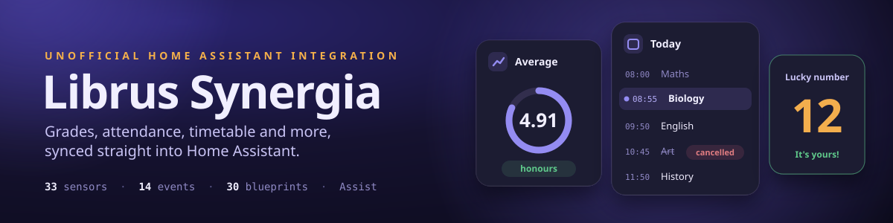
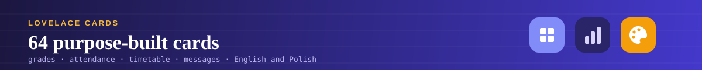
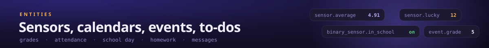
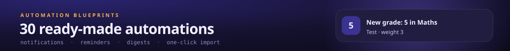
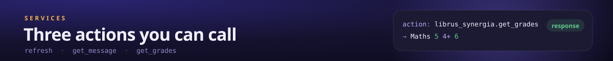

# Librus Synergia (unofficial) for Home Assistant

  

  
  

A HACS-installable Home Assistant integration for [Librus Synergia](https://synergia.librus.pl/) - the Polish school e-register - pulling grades, attendance, behaviour notices, timetable, agenda, announcements, messages, and school/class info in as sensors and calendars.

> [!TIP]
> ⭐ **Enjoying this integration?** Every star is real motivation to keep building new features :)
>
> ☕ Want to say thanks another way? You can [buy me a coffee](https://buymeacoffee.com/zanula).

<!-- The badge lives OUTSIDE the alert on purpose: Home Assistant/HACS rewrites a GitHub alert
into <ha-alert> and drops every child whose textContent is empty, which silently removes any
 placed inside it. -->

 

  

**Contents:** [Why this exists](#why-this-exists) · [Credential model](#credential-model-read-this-before-installing) · [Installation](#installation) · [Weekly AI summary](#weekly-ai-summary) · [Ask Assist](#ask-assist-about-school) · [Cards](#custom-lovelace-cards) · [Entities](#entities) · [Blueprints](#automation-blueprints) · [Services](#services) · [Known limitations](#known-limitations--unverified-details) · [Related projects](#related-projects)

## Why this exists

An integration for Librus already exists ([`LukMaverick/LibrusSynergiaHA`](https://github.com/LukMaverick/LibrusSynergiaHA), built on [`RustySnek/librus-apix`](https://github.com/RustySnek/librus-apix)), but it logs into the legacy HTML Synergia portal, which can demand a reCAPTCHA a human has to solve - unworkable for something meant to sync unattended in the background.

This integration instead uses the login flow Librus's own website/app uses for its private API gateway - reverse-engineered from [`emsi/librus_pyapi`](https://github.com/emsi/librus_pyapi) (MIT), which was itself updated to track a Librus authentication change on 2026-03-28. Confirmed live (2026-09-05) to complete without a captcha challenge for a normal login. An older password-grant login (the one documented by the open-source [`szkolny-eu/szkolny-android`](https://github.com/szkolny-eu/szkolny-android) app) no longer works: Librus now answers it with `unsupported_grant_type`.

The Librus client itself lives in a separate library, [**librus-synergia**](https://github.com/MichalZaniewicz/librus-synergia) (`pip install librus-synergia`). You can use it outside Home Assistant, and it comes with an [unofficial Librus API reference](https://michalzaniewicz.github.io/librus-synergia/).

**This is an unofficial integration using a private API and may violate Librus's Terms of Service. Use your own account at your own risk.**

  

## Credential model (read this before installing)

Unlike some cloud-polling integrations, **your Librus password is stored** in Home Assistant's config storage, alongside the session. This is a deliberate tradeoff, not an oversight: the session cookie this flow obtains is only valid for about a day and there is no separate refresh grant, so silent, unattended daily renewal isn't possible without it. Your password never leaves your Home Assistant instance.

A long-lived device-recognition cookie is also persisted and re-sent on every login - this is believed to be why a normal login skips any captcha/2FA challenge, so treat it as load-bearing, not just a convenience.

If you change your Librus password or mistype the login, use the integration's **Reconfigure** option (⋮ menu on the entry, in Settings → Devices & services) rather than deleting and re-adding it - that keeps your entity ids, dashboards and automations intact. Reconfigure refuses to repoint an entry at a genuinely different Librus account; add a new integration entry instead if you want to add another student.

  

## Installation

1. HACS → ⋮ → **Custom repositories** → add this repo as category **Integration** (or use the badge above).
2. Install **Librus Synergia (unofficial)**, restart Home Assistant.
3. Settings → Devices & services → **Add integration** → search "Librus Synergia".
4. Enter your Librus **login** (e.g. `1234567u` - a direct student/account login, not a Librus Portal e-mail) and password.

Each child/student is a separate login and a separate integration entry.

  

## Weekly AI summary

Once a week, an AI model of your choice writes a summary of the school week,
split into sections:

| Section | What it covers |
|---|---|
| **Grades** | Every grade from the week (subject, category, weight, teacher's comment), what went well and what didn't, and how the averages moved compared with a week earlier |
| **Attendance** | Absences and lates, which subjects were missed, what still needs to be excused |
| **Behaviour** | Notes from the week, the behaviour grade, streaks |
| **Next week** | Tests and other agenda entries, homework due, cancelled lessons and substitutions, free days |
| **From the school** (optional) | The important points of the week's messages and announcements: meetings, trips, payments, deadlines |

On top: a one-line headline and an overall status (*good* / *OK* / *needs
attention*). At the bottom: 2-4 concrete to-dos for the coming week, and a
warning only when something really needs attention. Each section has its own
status too, so a dashboard card or a notification can show at a glance what
to look at.

*Shown in the [Weekly AI summary card](https://github.com/MichalZaniewicz/ha-librus-synergia-cards) (example text).*

### How to set it up

You need Home Assistant **2025.8 or newer** (it uses the built-in
[AI Task](https://www.home-assistant.io/integrations/ai_task/) feature).
There is no API key in this integration: the summary goes through whatever AI
provider you already use in Home Assistant.

1. **Add an AI provider to Home Assistant**, if you don't have one yet:
   *Settings → Devices & services → Add integration*, then pick e.g.
   **Google Generative AI** (Gemini), **OpenAI**, **Anthropic** or
   **Ollama** (runs locally, nothing leaves your network). Follow its own
   setup (usually an API key from the provider). It creates an **AI Task**
   entity such as `ai_task.google_ai_task`.
2. **Turn the summary on:** *Settings → Devices & services → Librus Synergia →
   Configure → Weekly AI summary*, and fill in:

   | Field | What to choose |
   |---|---|
   | **AI model** | The AI Task entity from step 1. Leave it empty to turn the feature off |
   | **Written to** | **Parent**: third person, with what you can do. **Student**: written to your child directly, encouraging |
   | **Day** and **Time** | When the weekly summary is written (default Sunday 18:00). It covers the 7 days up to that day and previews the 7 days after |
   | **Include messages and announcements** | Off by default. On adds the *From the school* section, but then private messages and school announcements are sent to the AI provider |
   | **Your notes for the AI** | Optional context, e.g. *"Eighth-grade exam this year, chemistry is the weaker subject"* |

   Save. Three new entities appear on the student's device:
   - **Weekly summary** sensor: the headline is its state; sections, to-dos and warning are attributes.
   - **Generate weekly summary** button.
   - **Automatic weekly summary** switch.
3. **Write the first one now:** press **Generate weekly summary**. It takes
   a few seconds; then the **Weekly summary** sensor shows the headline.
4. **Show it on a dashboard** with the **Weekly AI summary** card from
   [Librus Synergia Cards](https://github.com/MichalZaniewicz/ha-librus-synergia-cards)
   (`type: custom:librus-ai-summary-card`, no other configuration needed). It
   has tabs for the sections and its own **Generate now** button.
5. **Get it on your phone** with the
   [Weekly AI Summary Report](#automation-blueprints) blueprint. It sends a
   short report (headline, section statuses, to-dos) or the full text. You
   choose the sections, and can limit it to weeks that need attention.

With more than one child, set it up on each child's entry. Each one gets its
own summary, and the blueprint's title says whose it is.

### What gets sent, and when

- Only data the integration already has: no extra Librus requests. The AI
  provider receives the student's name and class, the week's grades, the
  averages, the week's attendance and behaviour notes, how many absences
  are still unexcused, and the coming week's agenda, homework due and
  timetable changes. Messages and announcements are included only if you
  turned that on. Use a local model (Ollama) if nothing should leave your
  network.
- **One request a week**, plus any time you press the button. A run missed
  because Home Assistant was off is made up within 2 days. A week with no
  lessons and nothing coming up (holidays) is skipped, so it costs nothing.
- The **Automatic weekly summary** switch pauses the schedule; the button
  still works.
- The result is stored, so a restart does not pay for the same summary twice.
  A new summary fires the `librus_synergia_weekly_summary` event.

### If something doesn't work

- **"The AI Task integration is not available"** when opening *Weekly AI
  summary*: update Home Assistant to 2025.8+ and add an AI provider first
  (step 1).
- **The sensor stays empty after pressing the button:** look at its `error`
  attribute. It holds the provider's message, e.g. an exhausted quota or a
  wrong API key.
- The text is written by an AI model. It is told to stick to the data it
  gets, but it can still make mistakes, so check anything important in
  Librus itself.

  

## Ask Assist about school

Turn Librus on as a tool set for your Assist conversation agent (Gemini,
OpenAI, Claude, Ollama...) and ask about school in plain words (in any language your agent speaks), by voice or
in the Assist chat:

- "What does Ola have tomorrow, and when does school start?"
- "What grades did she get this week?"
- "When is the next maths test?"
- "How many absences still need an excuse?"

**Setup:** Settings → Devices & services → your AI integration (e.g. Google
Generative AI) → the conversation agent's **Configure** → under *Control
Home Assistant* tick **Librus Synergia** (you can keep *Assist* ticked too).
Then pick that agent in Settings → Voice assistants.

The agent gets seven read-only tools: timetable for any day, grades and
averages, what's coming up (tests, homework, days off, timetable changes),
attendance, behaviour, school and class info (incl. the lucky number), and
recent messages and announcements. They answer from data the integration
already holds, so a question adds no Librus request (a timetable date
outside the current and next week fetches that one week). Nothing is
changed or sent to Librus. With more than one child, name the child in the
question; otherwise the agent gets every child.

What you ask, and the tool results it needs, go to the AI provider behind
that agent. Use a local model (Ollama) if nothing should leave your network.

  

## Custom Lovelace cards

Want a dashboard without wiring these sensors into generic entity cards by hand?
**[Librus Synergia Cards](https://github.com/MichalZaniewicz/ha-librus-synergia-cards)**
is a companion HACS repo with 59 purpose-built cards: grades and trends, attendance,
timetable, agenda, messages, announcements, a "Today" overview, and a few playful ones.
Each card finds your child's device on its own (no YAML for one student), follows your
Home Assistant theme and language (English, Polish).

  

## Entities

| Type | Entity | Notes |
|---|---|---|
| `sensor` | Overall grade average | Average across every subject - weighted by default, or the plain arithmetic mean if you pick that under **Configure**; attributes carry both (`average_weighted`, `average_arithmetic`) plus `average_semester_1`/`average_semester_2` |
| `sensor` | *Subject* average (one per subject) | Discovered automatically from your account; attributes include the subject name, full grade log, text grades (`text_grades`: grades a teacher entered as text, which aren't in the grade log), latest grade (with any teacher comments), proposed/final semester grades and per-semester / arithmetic averages; each entry in the `grades` list marks corrections (`improves` / `improved`). Forecast attributes: `forecast_average`/`forecast_weight` (the average and the sum of weights it's computed on), `predicted_grade`, `next_grade_at`, `sixes_to_next_grade`, `ones_to_drop_grade`, `forecast_declining` (see Grade forecast) |
| `sensor` | Grade forecast | The report card the averages point to: the state is the mean of every subject's forecast grade. Per subject (`subjects`, worst first): the average, the forecast grade, how many 6s lift it a grade (`sixes_to_next`) and how many 1s drop it (`ones_to_drop`), whether it fell by a grade in the last two weeks (`declining`) and the teacher's proposition once there is one. Also `at_risk` (subjects heading for a 1), `declining`, `honours_average` (at least 4.75, the average part of a certificate with distinction) and `basis`: the first semester's grades until the semester ends, then the whole school year. The thresholds are set under **Configure** - check your school's statute (WSO); the teacher decides the real grade |
| `sensor` | Attendance | Count of real absences (excludes "present"/"late"/"excused" marks); full per-type breakdown, total record count, an independently-computed `percentage` (works even if your school hides this), and `by_semester`/`by_weekday`/`by_subject` breakdowns in attributes |
| `sensor` | Unexcused absences | Just the count of absences that still need a justification (the Attendance sensor's state blends excused + unexcused); `recent_dates` in attributes, split into `awaiting_justification` (no justification sent yet) and `justification_sent` (sent, waiting for the school) |
| `sensor` | Absence justifications | The justifications you submitted in Librus: the state is how many are still waiting for the school's decision; `accepted`/`rejected`/`pending` counts and a `recent` list (sent date, days and lessons covered, status, your message, teachers notified) in attributes |
| `sensor` | Lowest subject attendance | Attendance percentage of the subject where it is lowest - the one to watch for the 50% rule, below which a student can be left unclassified. `subject` names it, `subjects` lists every subject (`total`/`present`/`absent`/`percentage`), `at_risk` the ones already under 50% |
| `sensor` | Next lesson | Subject name of the next lesson that will actually take place (cancelled slots skipped); attributes carry `start`/`end`, `minutes_until`, teacher, classroom, period number and substitution flag, plus what a substitution changes: `change` (`substitution` / `room_change` / `moved`), `room_changed`, `original_classroom`, `original_subject`, `original_teacher` |
| `sensor` | Current lesson | Subject name of the lesson happening right now (`unknown` during breaks / outside school hours); attributes include `minutes_left` and the same period detail |
| `sensor` | School start | When the next first lesson starts (`device_class: timestamp`): today's until it starts, then the next school day's. Cancelled lessons and free days are skipped. An automation can trigger on it with an offset - see the [School Wake-Up](#automation-blueprints) blueprint |
| `sensor` | School end | When the last lesson of today (or of the next school day) ends - for pick-up reminders |
| `binary_sensor` | School day today / School day tomorrow | On when that day has lessons that aren't cancelled and isn't a free day - a condition for alarm clocks, heating schedules and the like. `first_lesson_start`/`last_lesson_end` in attributes |
| `binary_sensor` | Grade at risk | On while any subject's average points to a 1 (`device_class: problem`); `subjects` (with how many 6s get it out) and `declining` in attributes |
| `binary_sensor` | At school | On from the first lesson's start to the last lesson's end today, breaks included (by the timetable, not by location). Re-checked every minute |
| `sensor` | Next exam | Date of the next graded assessment on the Agenda (`device_class: date`); attributes carry `days_until`, subject, category and an `upcoming` list |
| `sensor` | Lucky number | The most recently published "szczęśliwy numerek" - Librus can publish the *next* school day's number a day ahead, so check the `is_today`/`day` attributes rather than assuming the state is always for today. `is_yours` says whether it's your child's class-register number, read from Librus automatically (override under **Configure**; `student_number_source` says which) |
| `sensor` | Unread announcements | Count, with a `recent` attribute (subject/content preview/dates) |
| `sensor` | Behaviour notices | Count, with a short recent-items attribute including the resolved category name and sentiment (positive/negative/neutral) |
| `sensor` | Unread messages | Count of unread Wiadomości in your main inbox, with sender/topic/preview for the most recent ones (including each message's `id`/`mailbox`, for the [`get_message` service](#services)) and a `mailbox_breakdown` attribute (inbox/notes/alerts/substitutions/absences/justifications/trash unread counts). Also carries full preview content (not just a count) for the two secondary mailboxes worth actually reading - `substitutions_recent` and `alerts_recent`. The routine poll never marks anything read - only the message list/count endpoints are used for that. Shows `unavailable` (not `0`) if your school hasn't enabled the messages module |
| `sensor` | School | Name, town/street, head teacher, contact details, and a `bell_schedule` attribute (period number -> start/end time, derived from the timetable) |
| `sensor` | Class | Class name (e.g. "7d"), homeroom teacher, the student's `student_number` (class register number), semester/school-year boundary dates |
| `sensor` | Homework assignments | Count of real "zadania domowe" (distinct from the Agenda calendar's general feed below), with a `recent` attribute (id/topic/text/due date/teacher, and the subject - worked out from the teacher, since Librus doesn't say; empty when that teacher teaches more than one subject) |
| `sensor` | Behaviour grade | Formal "ocena zachowania" (distinct from Behaviour notices above) - state is the most recent grade: the classic-scale short form (e.g. "bdb") or the points for a points-based school. `name` ("bardzo dobre") and the teacher's `comment` in attributes, plus a `recent` list (grade/name/category/date/comments) |
| `sensor` | Lesson topics | What was taught: the state is how many of today's lessons have a topic in Librus; `today` and `recent` (the last 14 days: date, lesson number, subject, topic, trip) in attributes. Handy for catching up after an absence. Past lessons in the Timetable calendar get a "Temat: ..." line too |
| `sensor` | Next school trip | Date of the next school trip (`device_class: date`); `destination`, `route`, `transport`, `coordinator`, `days_until`, `upcoming` and `past` in attributes |
| `sensor` | School documents | How many documents the school shares with parents (forms, regulations); `recent` lists them with a link that opens in Synergia |
| `sensor` | Point grades | Only at schools that grade in points or percent (e.g. 0-100). State: the share of points earned, weighted by category (only categories that count towards the average); `subjects` (percentage and count per subject) and `recent` (points, maximum, percentage, category, date, teacher) in attributes. The subject average sensors also get `points_percentage` and `point_grades`, and `librus_synergia.get_grades` returns them too |
| `sensor` | Descriptive grades | Count of non-numeric descriptive grades (this school has these enabled instead of point-scale grades), with a `recent` attribute (subject/value/date) |
| `sensor` | Attendance streak | Days since the last real absence - falls back to days since the school year started for a perfect-attendance student, rather than `unknown` |
| `sensor` | Good behaviour streak | Days since the last negative behaviour note, same fallback as Attendance streak |
| `sensor` | Good grades streak | Consecutive most-recent numeric grades of 4 or better - a non-numeric mark (`bz`/`np`/...) doesn't break it, only an actual low grade does |
| `sensor` | Rank | A cosmetic Bronze/Silver/Gold/Diamond tier derived from your overall average (`device_class: enum`) - `points_to_next_tier` in attributes shows how much more average you need for the next one up |
| `sensor` | Weekly summary | Only with the [weekly AI summary](#weekly-ai-summary) set up. The AI's headline for the week; `status`, `sections` (grades/attendance/behaviour/next_week, plus school_news if enabled - each `{status, text}`), `advice`, `warning`, `week_from`/`week_to`, `next_run` and `error` in attributes. Comes with a **Generate weekly summary** button and an **Automatic weekly summary** switch |
| `sensor` | Connection status | Diagnostic: `ok`, `degraded` (some part of Librus failed this cycle and its last good copy is shown), `stale` (Librus isn't answering - the last data is shown) or `error` (no usable data). Stays available during an outage; `last_success`, `last_error`, `failures`, `next_attempt`, `fallback_sections` and `degraded_endpoints` in attributes |
| `sensor` | Last successful update | Diagnostic: when Librus last answered a full refresh (`device_class: timestamp`) - also how old the data shown during an outage is. Kept across restarts |
| `button` | Generate weekly summary | Only with the weekly AI summary set up: writes the summary right away |
| `switch` | Automatic weekly summary | Only with the weekly AI summary set up: pauses or resumes the weekly schedule (the button still works) |
| `calendar` | Timetable | Lesson plan, including known cancellations and substitutions. A lesson's title says what changed - "(odwołane)", "(zastępstwo)", "(zmiana sali)" or "(przeniesiona)" - and the description adds the details: "Zastępstwo za: Chemia, Jan Kowal", "Zmiana sali: 12 → 21", "Przeniesiona z: 29.09, lekcja 3" |
| `calendar` | Agenda | Tests, trips, parent meetings and other school events, prefixed with their category (e.g. "[Sprawdzian] ...") when known |
| `calendar` | Free days | The whole school year's holidays/breaks |
| `todo` | Homework | The homework assignments as a Home Assistant to-do list, with due dates. Ticking one off is stored in Home Assistant (Librus has no "done" flag), so it's shared across phones and family members; done items drop off 14 days after their due date |
| `event` | New grade / New behaviour note / New absence / Timetable change / New homework / New agenda entry / Agenda entry changed / Absence justification decided / New school trip / New school document / New announcement / New message / Grade forecast changed / Achievement unlocked | One event entity per kind, for building automations in the UI ("When the New absence event fires") without blueprints or event names; every occurrence also lands in the logbook. The event type tells kinds apart where it matters: a note is `positive`/`negative`/`neutral`, an absence `excused`/`unexcused`, a timetable change `canceled`/`substitution`, an agenda change `changed`/`removed`, a justification decision `accepted`/`rejected`/`changed`, a forecast change `up`/`down`. The event's attributes carry the same details as the bus events below |

New grades, announcements, behaviour notices, messages, Agenda entries, homework assignments and absences fire Home Assistant bus events (`librus_synergia_new_grade`, `librus_synergia_new_announcement`, `librus_synergia_new_note`, `librus_synergia_new_message`, `librus_synergia_new_homework` (Agenda), `librus_synergia_new_homework_assignment` (real homework: topic, text, due date, teacher, subject), `librus_synergia_new_absence`), and a cancelled/substitution lesson fires `librus_synergia_timetable_changed` - all for building notification automations. `librus_synergia_achievement_unlocked` fires for a handful of objective, data-derived gamification milestones (first six, good-grade streaks of 5/10/20, and 7/30/90-day streaks without an absence or a negative note) - deliberately not an invented points system, every one of these is a plain, honest fact anyone could verify by hand. `librus_synergia_forecast_changed` fires when a subject's forecast grade moves up or down (`subject`, `old`, `new`, `direction`, `average`, `sixes_to_next`, `ones_to_drop`). `librus_synergia_new_school_trip` and `librus_synergia_new_school_document` fire for a new school trip (`destination`, `route`, `transport`, `date_from`, `date_to`, `coordinator`) and a new document the school shared (`name`, `added`, `url`); a new text grade fires `librus_synergia_new_grade` with `kind: text`. `librus_synergia_justification_status` fires when the school decides on a justification you sent (`status`, `previous_status`, `accepted`, `rejected`, `date_from`, `date_to`, `justified_absences`, `message`, `teachers`). `librus_synergia_timetable_changed` also says what a substitution changes (`change`: `substitution` / `room_change` / `moved`, with `teacher`, `original_subject`, `original_teacher`, `classroom`, `original_classroom`, `original_date`, `original_lesson_no`). `librus_synergia_agenda_changed` fires when an upcoming Agenda entry changes (`kind: changed`, with `changed_fields` and the old values in `previous` - e.g. a test moved to another day) or disappears from Librus (`kind: removed`). Nothing fires on the very first sync after setup (that run only establishes the baseline). What has already been announced is saved, so something that arrives while Home Assistant is off still fires once it's back. Grade/note/homework/timetable events include the resolved subject/teacher/category name alongside the raw id, so an automation doesn't need its own lookup. `librus_synergia_new_grade` also carries the grade's details: `teacher`, `category`, `weight`, `counts_to_average`, `comments` (list), `date`, `semester` and `kind` (`normal` / `semester_proposition` / `semester` / `final_proposition` / `final`). Ready-made [blueprints](#automation-blueprints) wrap these for you.

The integration's **Configure** menu has two parts. *Settings* sets the poll interval (default 20 minutes), whether the average sensors show the weighted or the arithmetic average, the **grade forecast thresholds** (minimum average for a 2, 3, 4, 5 and 6; default `1.75, 2.75, 3.75, 4.75, 5.50`), and whether to fetch private messages at all - turn *Fetch private messages* off if your school doesn't use Wiadomości or you don't want those extra requests (the Unread messages sensor then reports `unavailable`). Two more switches there: **Smart polling** keeps the poll interval on school days between 06:00 and 22:00 but fetches at most hourly on days without lessons and at most every 3 hours at night (the `librus_synergia.refresh` action always fetches straight away), and **Hide subjects without grades** creates a subject's average sensor only once it has its first grade. *Weekly AI summary* sets up the [weekly AI summary](#weekly-ai-summary).

**When Librus is down.** The integration keeps the last good response of every part of Librus (in Home Assistant's own storage). If one part fails - grades, the timetable, subject names - its last good copy is shown instead of an empty sensor. If Librus doesn't answer at all, every entity keeps showing the last data (the *Connection status* sensor says `stale`) for up to 3 days; after two failed refreshes in a row the next attempts are spaced out (twice the poll interval, then four times, up to 2 hours), so an outage isn't met with a login attempt every cycle - the `librus_synergia.refresh` action still tries straight away. If Home Assistant starts while Librus is down, the data is rebuilt from the saved responses instead of the integration failing to load. Long lists in attributes (grade logs, `recent` lists, breakdowns) aren't written to the recorder's history, which keeps the database small; templates and cards read them as before.

**Grade averages over the whole year.** The integration also writes the history of the overall and per-subject averages, rebuilt from the grades' dates, into Home Assistant's long-term statistics - so a chart covers the school year from its first grade, not just the time since you installed the integration. Add a **Statistics graph** card and pick e.g. *"Ola Kowalska - średnia Matematyka"* (statistic type *Mean*). It's rewritten whenever the grades change; it needs the Recorder, which is on by default.

  

### Automation blueprints

Ready-to-import blueprints under
[`blueprints/automation/librus_synergia/`](blueprints/automation/librus_synergia/) wrap
the events above so you don't have to write the YAML yourself - each just asks for an
*action* (e.g. "Send a notification"):

<b>Show all 28 blueprints</b>

| Blueprint | What it does | |
| --- | --- | --- |
| [New Grade Notification](blueprints/automation/librus_synergia/new_grade_notification.yaml) | Runs your action with a summary whenever `librus_synergia_new_grade` fires - optionally with a second line showing the category, weight, date and teacher's comment. |  |
| [New Behaviour Notice Notification](blueprints/automation/librus_synergia/new_note_notification.yaml) | Runs your action with a one-line summary whenever `librus_synergia_new_note` fires. |  |
| [New Announcement Notification](blueprints/automation/librus_synergia/new_announcement_notification.yaml) | Runs your action with the title whenever `librus_synergia_new_announcement` fires. |  |
| [New Message Notification](blueprints/automation/librus_synergia/new_message_notification.yaml) | Runs your action with a one-line summary whenever `librus_synergia_new_message` fires. |  |
| [New Homework Assignment Notification](blueprints/automation/librus_synergia/new_homework_assignment_notification.yaml) | Runs your action whenever a new real homework assignment ("zadanie domowe") appears - topic, due date, teacher, subject and, optionally, the instructions. |  |
| [Lesson Change Notification](blueprints/automation/librus_synergia/lesson_change_notification.yaml) | Runs your action with a one-line summary whenever `librus_synergia_timetable_changed` fires (a lesson newly cancelled, substituted, moved to another room or to another time) - the message says what changed, e.g. "Zmiana sali: Matematyka (2026-10-08, 09:50) - sala 12 → 21" or "Zastępstwo: Biologia - za Chemia, prowadzi Anna Nowak". |  |
| [New Agenda Entry Notification](blueprints/automation/librus_synergia/new_homework_notification.yaml) | Runs your action whenever `librus_synergia_new_homework` fires - optionally filtered to one category (e.g. only "Sprawdzian"). |  |
| [Agenda Entry Changed or Removed](blueprints/automation/librus_synergia/agenda_change_notification.yaml) | Runs your action when `librus_synergia_agenda_changed` fires - an upcoming test moved to another day, a new time or description, or an entry removed from Librus - optionally only for some categories. Comes with a ready-made message ("Ola: [Sprawdzian] Matematyka - termin 12.10 → 14.10"). |  |
| [Unexcused Absence Notification](blueprints/automation/librus_synergia/unexcused_absence_notification.yaml) | Runs your action whenever `librus_synergia_new_absence` fires for an absence that isn't excused yet. |  |
| [Absences To Justify Reminder](blueprints/automation/librus_synergia/absence_justification_reminder.yaml) | At a set time on the days you pick, runs your action with a `{{ reminder_text }}` (count + dates) for as long as there are unexcused absences left - silent once everything is excused, and days you've already sent a justification for are left out. |  |
| [Absence Justification Decided](blueprints/automation/librus_synergia/justification_status_notification.yaml) | Runs your action when `librus_synergia_justification_status` fires - the school accepted or rejected a justification you sent (optionally only rejections). Ready-made message: "Ola: usprawiedliwienie za 14.09 - 16.09 przyjęte (5 nieobecn.)." |  |
| [School Trip Tomorrow](blueprints/automation/librus_synergia/school_trip_reminder.yaml) | At a set time, the day before a school trip, runs your action with the destination, transport and route ("Ola: jutro wycieczka - Muzeum Narodowe (autokar)."). |  |
| [New School Document](blueprints/automation/librus_synergia/new_school_document_notification.yaml) | Runs your action when the school shares a new document with parents ("Ola: szkoła udostępniła dokument „Regulamin wycieczek”"). |  |
| [Low Subject Attendance](blueprints/automation/librus_synergia/low_subject_attendance_notification.yaml) | Runs your action when the Lowest subject attendance sensor crosses below a percentage you set (default 60%) - a heads-up before any subject gets near the 50% mark. |  |
| [Test Tomorrow Reminder](blueprints/automation/librus_synergia/exam_tomorrow_notification.yaml) | At a set time each day, runs your action with an `{{ exam_summary }}` only when a test or quiz is on the Agenda for the next day - silent otherwise. |  |
| [Your Lucky Number](blueprints/automation/librus_synergia/lucky_number_yours_notification.yaml) | Runs your action when the published lucky number is your child's class-register number (read from Librus; override under **Configure**). |  |
| [Morning Briefing](blueprints/automation/librus_synergia/morning_briefing_notification.yaml) | At a set time on school days, builds a `{{ briefing_text }}` (first lesson + room, today's lucky number, any test within 3 days) and runs your action - speak it, or notify. |  |
| [School Wake-Up](blueprints/automation/librus_synergia/school_wake_up.yaml) | Runs your action a set number of minutes before the first lesson of each school day (alarm, music, lights, blinds). Follows the timetable: a day starting with lesson 2 wakes later, days off stay silent. `{{ wake_summary }}` is a ready-made message. |  |
| [School Pick-Up Reminder](blueprints/automation/librus_synergia/school_pickup_reminder.yaml) | Runs your action a set number of minutes before the last lesson ends - time to leave for pick-up. `{{ pickup_summary }}` is a ready-made message. |  |
| [Copy School Events to a Calendar](blueprints/automation/librus_synergia/school_calendar_sync.yaml) | Copies tests, quizzes, trips, meetings and days off into a calendar of your choice (e.g. a family Google Calendar) - daily for the coming days and right after a new Agenda entry. Pick which Agenda categories to copy; entries already there are skipped. Home Assistant can only add events, so a moved test leaves its old date to delete by hand. |  |
| [Low Grade Alert](blueprints/automation/librus_synergia/low_grade_notification.yaml) | Runs your action only for a new grade at or below a threshold you set (default 2) - non-numeric marks are ignored. |  |
| [Subject Average Dropped](blueprints/automation/librus_synergia/subject_average_drop_notification.yaml) | Runs your action when a subject-average sensor crosses below a value you set (default 3.5) - once on the way down, again only after it recovers. |  |
| [Grade Forecast Changed](blueprints/automation/librus_synergia/grade_forecast_notification.yaml) | Runs your action when a subject's forecast report-card grade moves (`librus_synergia_forecast_changed`) - by default only when it drops - with a `{{ forecast_summary }}` that says what it takes to win it back ("one 6 lifts it again"). |  |
| [Weekly AI Summary Report](blueprints/automation/librus_synergia/weekly_ai_summary_notification.yaml) | Sends the weekly AI summary when it is written (`librus_synergia_weekly_summary`) - short (headline, section statuses, to-dos) or full text, pick the sections, optionally only for weeks that need attention. Needs the weekly AI summary set up under **Configure**. |  |
| [Weekly Digest](blueprints/automation/librus_synergia/weekly_digest_notification.yaml) | Every Sunday at a set time, builds a `{{ digest_text }}` (tests due in the next 7 days, optionally homework due and any unexcused absence count) and runs your action. |  |
| [Homework Due Tomorrow](blueprints/automation/librus_synergia/homework_due_tomorrow_notification.yaml) | At a set time each day, runs your action with a `{{ homework_summary }}` only when a real Homework assignment ("zadanie domowe") is due the next day - silent otherwise. |  |
| [Time to Leave](blueprints/automation/librus_synergia/time_to_leave_notification.yaml) | Runs your action once, right when it's time to leave for the next lesson (its start time minus your travel time), checked every minute for accuracy regardless of your poll interval. |  |
| [Achievement Unlocked](blueprints/automation/librus_synergia/achievement_unlocked_notification.yaml) | Runs your action whenever `librus_synergia_achievement_unlocked` fires - a gamification milestone (first six, grade streaks, absence/behaviour-free streaks). Fires at most once per achievement, ever. |  |

Or import manually: Settings -> Automations & Scenes -> Blueprints -> Import
Blueprint, and paste a blueprint's GitHub URL.

  

## Services

### `librus_synergia.refresh`

Forces an immediate data refresh instead of waiting for the next poll - handy
right before a morning-briefing automation. Optional `device_id` targets one
student; omit it to refresh every configured student. Uses the coordinator's
debounced refresh, so it's safe to call often.

### `librus_synergia.get_message`

Fetches ONE message's full, untruncated content (the Unread messages sensor's
`recent` attribute only ever carries a short preview - Librus itself truncates
that field). **This marks the message as read on Librus's servers, exactly
like opening it in the Librus app or website** - confirmed live: a message's
`readDate` flips from empty to a real timestamp the moment this is called.
Only call it for a message someone has actually chosen to open (e.g. the
[Librus Synergia Cards](https://github.com/MichalZaniewicz/ha-librus-synergia-cards)
Wiadomości card does this when you click a message) - never on a schedule or
from an automation that isn't a direct response to someone opening it.

| Field | Description |
|---|---|
| `device_id` | The Librus Synergia device (student) to fetch from. |
| `message_id` | The message's `id`, from the Unread messages sensor's `recent`/`substitutions_recent`/`alerts_recent` attribute. |
| `mailbox` | Which mailbox the message is in - defaults to `inbox`; use `substitutions` or `alerts` for a message from those attributes. |

Returns `id`, `mailbox`, `sender`, `topic`, `content` (full text),
`send_date`, `read_date`, `has_attachment`, and `attachments` (a list of
`id`/`filename`). To download a file, open
`/api/librus_synergia/attachment/<device id>/<message id>/<attachment id>` while
logged in to Home Assistant - it passes the file straight from Librus to the
browser without saving it in Home Assistant or opening the message in Librus.
The companion Messages card does this when a file name is tapped.

### `librus_synergia.get_grades`

Returns every grade for a student in one response, optionally filtered to
one subject via `subject_id` - the single-call equivalent of reading each
subject average sensor's own `grades` attribute separately. Reads straight
from already-fetched data, no extra Librus request, so it's safe to call
from a routine automation (unlike `get_message`).

| Field | Description |
|---|---|
| `device_id` | The Librus Synergia device (student) to fetch grades for. |
| `subject_id` | Optional - limit to one subject, using a subject average sensor's `subject_id` attribute. |

Returns `grades` (a list of `subject`, `subject_id`, `value`, `category`,
`date`, `semester`, `comments`, newest first) and `count`.

## Known limitations / unverified details

Almost everything this integration reads has been checked against a real account. The open points below are data the test account simply hasn't had yet. For some of them, the field names come from other open-source Librus clients' documentation of the API (see [Acknowledgments](#acknowledgments)); no code was copied from those projects.

**Waiting for real data:**
- **Semester and year grades, proposed and final:** the fields are in Librus's grade data and these grades are left out of averages and streaks, but none have been issued yet. The first semester ends on 2027-01-31.
- **Descriptive grades:** the sensor is in place, but the endpoint has been empty on every check so far.
- **Behaviour grade on a points scale:** the classic scale (wz, bdb, db, popr, ndp, ng) is confirmed on a real account; the points variant some schools use has not been seen yet.
- **Grade corrections ("poprawy"):** the link from a correction to the grade it replaces comes from another client's reading of the API; no correction has appeared on the test account yet.

**Deliberately not supported:**
- **Point grades, text grades and virtual classes.** The client can fetch them, but no entity uses them: point grades are disabled at the test school, and the others had nothing to show.

**Never tested on purpose:**
- **A wrong password.** To avoid tripping Librus's abuse protection on a real family's account, it was never tried. "Invalid credentials" is inferred from the shape of the login response.

For the full, endpoint-by-endpoint picture, see the [unofficial Librus API notes](https://michalzaniewicz.github.io/librus-synergia/) in the librus-synergia library. If you see something that contradicts them, please open an issue with what you saw (redact personal data first).

## Related projects

- **[Librus Synergia Cards](https://github.com/MichalZaniewicz/ha-librus-synergia-cards)**: 61 Lovelace cards for this integration.
- **[librus-synergia](https://github.com/MichalZaniewicz/librus-synergia)**: the Python library this integration is built on (`pip install librus-synergia`). Use it in your own scripts, or from the command line.
- **[Unofficial Librus API notes](https://michalzaniewicz.github.io/librus-synergia/)**: the login flow and every endpoint's response shape.

## Acknowledgments

- [`emsi/librus_pyapi`](https://github.com/emsi/librus_pyapi) (MIT): the current login flow is based on this project's implementation.
- [`szkolny-eu/szkolny-android`](https://github.com/szkolny-eu/szkolny-android) (GPL-3.0): an independent, open-source e-register app. Its source helped identify Librus's endpoint and field names. No code was taken from it.
- [`RustySnek/librus-apix`](https://github.com/RustySnek/librus-apix): referenced for grade-value conventions.

## License

MIT - see [LICENSE](LICENSE).
