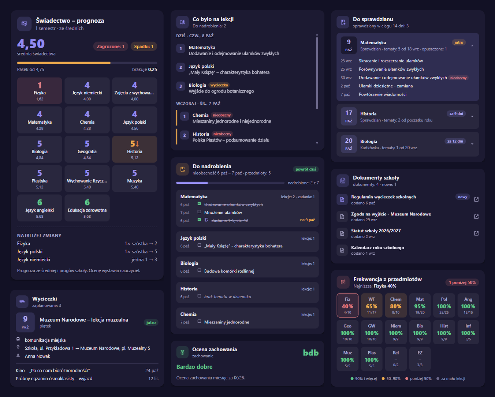

# Librus Synergia (unofficial) for Home Assistant

  

  
  

Your child's [Librus Synergia](https://synergia.librus.pl/) e-register, inside Home Assistant. Grades, attendance, the timetable, tests, homework, messages and the lucky number become sensors and calendars, with notifications and automations that actually help a family's school week.

> [!TIP]
> ⭐ **Enjoying this integration?** Every star is real motivation to keep building new features :)
>
> ☕ Want to say thanks another way? You can [buy me a coffee](https://buymeacoffee.com/zanula).

<!-- The badge lives OUTSIDE the alert on purpose: Home Assistant/HACS rewrites a GitHub alert
into <ha-alert> and drops every child whose textContent is empty, which silently removes any
 placed inside it. -->

 

  

  <b><a href="https://github.com/MichalZaniewicz/ha-librus-synergia/wiki">Documentation (wiki)</a></b> · <a href="https://github.com/MichalZaniewicz/ha-librus-synergia/wiki/Installation">Installation</a> · <a href="https://github.com/MichalZaniewicz/ha-librus-synergia/wiki/Configuration">Configuration</a> · <a href="https://github.com/MichalZaniewicz/ha-librus-synergia/wiki/Entities">Entities</a> · <a href="https://github.com/MichalZaniewicz/ha-librus-synergia/wiki/Blueprints">Blueprints</a> · <a href="https://github.com/MichalZaniewicz/ha-librus-synergia-cards">Cards</a>

## What it does

- 📚 **Everything from the e-register.** Grades with comments and categories, averages per subject, attendance, behaviour notes and grade, the timetable, tests and homework, messages, announcements, the lucky number - and what was actually taught in each lesson.
- 📝 **Know what to revise.** For every upcoming test, the topics taught in that subject since the previous test, with the lessons your child missed marked - on a card, in a reminder a few days before, and in Assist's answers.
- 📚 **Catch up after an absence.** On the day your child is back, the topics of the missed lessons and the homework given meanwhile, per subject - as a notification and a card to tick off.
- 🎯 **Know the report card before it's written.** A forecast of every subject's report-card grade from its average and your school's thresholds, how many 6s lift it and how many 1s drop it, and an alarm when a subject heads for a 1.
- 🔔 **Notifications that matter.** A new grade, a cancelled lesson or a room change, a test tomorrow, a test moved to another day, a school trip, an unexcused absence - 30 ready-made blueprints, one click to import.
- 🏠 **The school day in your home.** *School day today/tomorrow* and *At school* sensors, school start and end times: wake the house before the first lesson, skip the alarm on a day off, remind you when to leave for pick-up. A sensor shows how this week differs from the usual timetable.
- 🤖 **A weekly summary written by AI.** Once a week, your own AI model in Home Assistant sums up grades, attendance, behaviour and the week ahead, with 2-4 concrete to-dos.
- 🗣️ **Ask Assist.** *"What does Ola have tomorrow?"* *"When is the next maths test?"* - by voice or in the chat.
- 📎 **Message attachments,** straight to your device, without marking the message read in Librus.
- 🛟 **Keeps working when Librus doesn't.** The last good data stays up through an outage, the session renews itself, and a normal login needs no captcha.
- 👨‍👩‍👧 **Several children.** One entry per child; every notification says whose news it is.

  

## Weekly AI summary

Once a week, the AI model you already use in Home Assistant (Gemini, OpenAI, Claude, or a local Ollama) sums up the school week: the grades and how the averages moved, attendance, behaviour, what's coming next week and, if you want, the important points from the school's messages. You get a one-line headline, a status per section, a warning only when something needs attention, and 2-4 concrete to-dos. No API key in this integration and no extra Librus requests.

Read it on the dashboard, get it as a phone notification with a blueprint, or press *Generate* any time. **[Setting it up](https://github.com/MichalZaniewicz/ha-librus-synergia/wiki/Weekly-AI-summary)**

## A dashboard in minutes

**[Librus Synergia Cards](https://github.com/MichalZaniewicz/ha-librus-synergia-cards)** is a companion repo with 65 cards made for this integration. They find your child's device on their own, follow your theme and speak English and Polish.

<b>All 65 cards</b>

  

## Get started

1. **HACS:** click the button below (or add this repository in HACS as an *Integration*) and download **Librus Synergia (unofficial)**.

   

2. **Restart** Home Assistant.
3. **Add the integration:** click the button below (or Settings → Devices & services → **Add integration** → **Librus Synergia**).

   

4. **Log in** with your child's Librus login (e.g. `1234567u`) and password. One entry per child.

Then pick the [blueprints](https://github.com/MichalZaniewicz/ha-librus-synergia/wiki/Blueprints) you want and add [the cards](https://github.com/MichalZaniewicz/ha-librus-synergia-cards). Full instructions, every option and every entity are in the **[wiki](https://github.com/MichalZaniewicz/ha-librus-synergia/wiki)**.

> [!NOTE]
> This is an unofficial integration using Librus's private API, and it may violate Librus's Terms of Service. Use your own account at your own risk. Your password is stored in Home Assistant (never sent anywhere but Librus) so the integration can log in again on its own when a session lapses - [why](https://github.com/MichalZaniewicz/ha-librus-synergia/wiki/Installation#your-password-and-the-session).

## Documentation

Everything else is in the **[wiki](https://github.com/MichalZaniewicz/ha-librus-synergia/wiki)**:

- **Getting started:** [Installation](https://github.com/MichalZaniewicz/ha-librus-synergia/wiki/Installation) · [Configuration](https://github.com/MichalZaniewicz/ha-librus-synergia/wiki/Configuration) - setting it up, every option with its default.
- **Features:** [Weekly AI summary](https://github.com/MichalZaniewicz/ha-librus-synergia/wiki/Weekly-AI-summary) · [Ask Assist](https://github.com/MichalZaniewicz/ha-librus-synergia/wiki/Ask-Assist) · [Blueprints](https://github.com/MichalZaniewicz/ha-librus-synergia/wiki/Blueprints) (all 30, with import buttons).
- **Reference:** [Entities](https://github.com/MichalZaniewicz/ha-librus-synergia/wiki/Entities) · [Events](https://github.com/MichalZaniewicz/ha-librus-synergia/wiki/Events) · [Services](https://github.com/MichalZaniewicz/ha-librus-synergia/wiki/Services) - every sensor and its attributes, every event and its data, the actions.
- **Background:** [How it works](https://github.com/MichalZaniewicz/ha-librus-synergia/wiki/How-it-works) · [Known limitations](https://github.com/MichalZaniewicz/ha-librus-synergia/wiki/Known-limitations) - the login, outages, the year-long grade history, what's still unverified.

## Related projects

- **[Librus Synergia Cards](https://github.com/MichalZaniewicz/ha-librus-synergia-cards)**: 65 Lovelace cards for this integration.
- **[librus-synergia](https://github.com/MichalZaniewicz/librus-synergia)**: the Python library this integration is built on (`pip install librus-synergia`). Use it in your own scripts, or from the command line.
- **[Unofficial Librus API notes](https://michalzaniewicz.github.io/librus-synergia/)**: the login flow and every endpoint's response shape.

## Acknowledgments

- [`emsi/librus_pyapi`](https://github.com/emsi/librus_pyapi) (MIT): the current login flow is based on this project's implementation.
- [`szkolny-eu/szkolny-android`](https://github.com/szkolny-eu/szkolny-android) (GPL-3.0): an independent, open-source e-register app. Its source helped identify Librus's endpoint and field names. No code was taken from it.
- [`RustySnek/librus-apix`](https://github.com/RustySnek/librus-apix): referenced for grade-value conventions.

## License

MIT - see [LICENSE](LICENSE).
